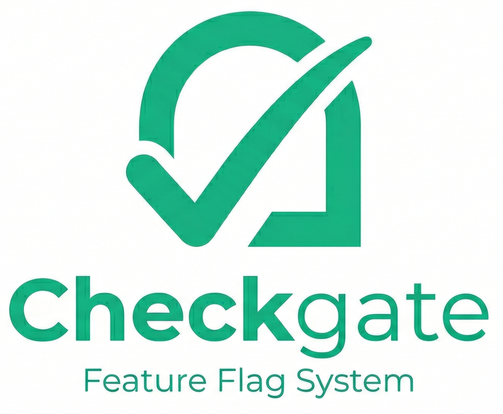
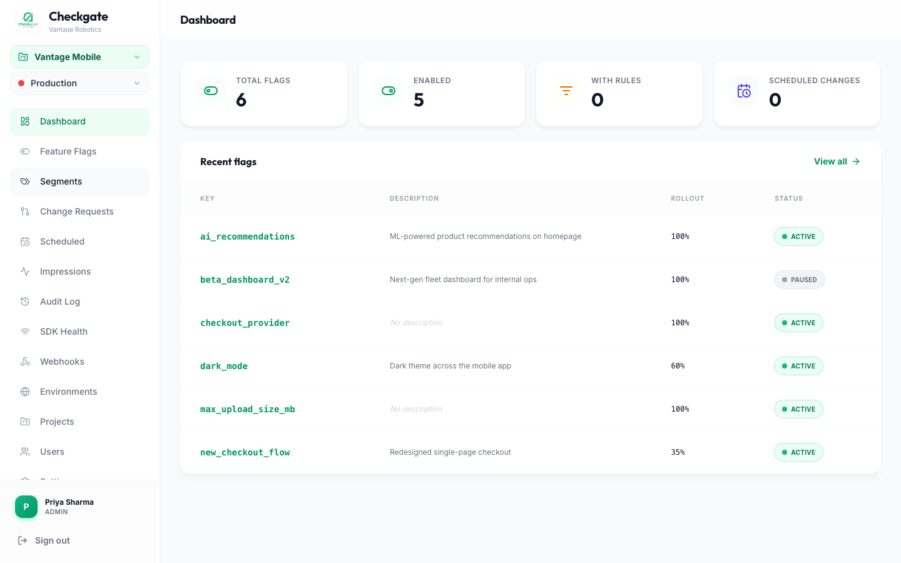
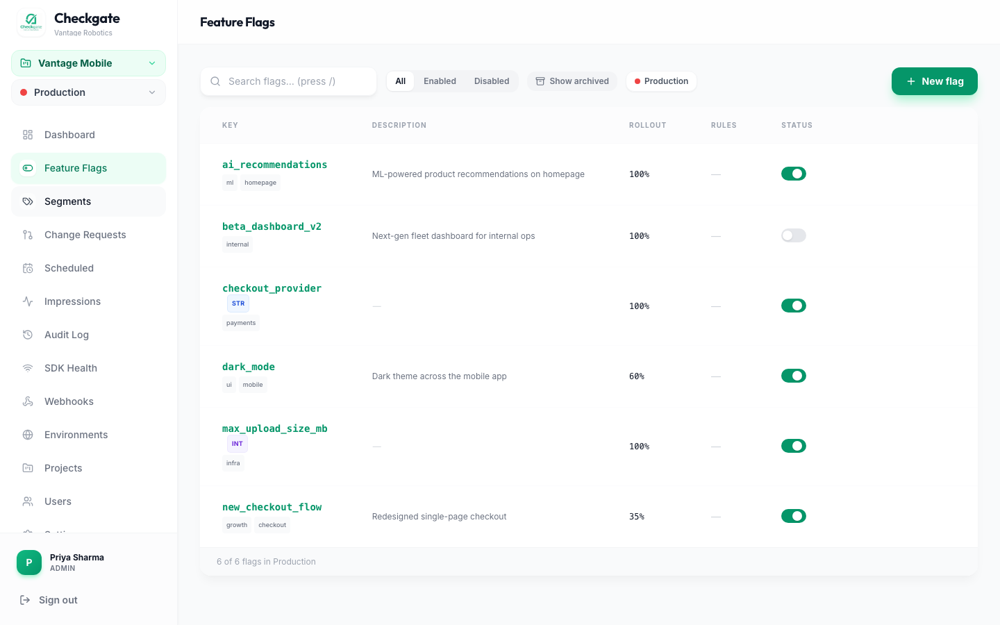
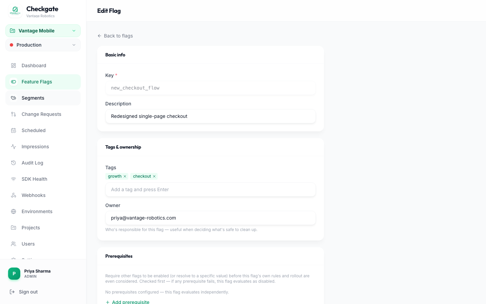
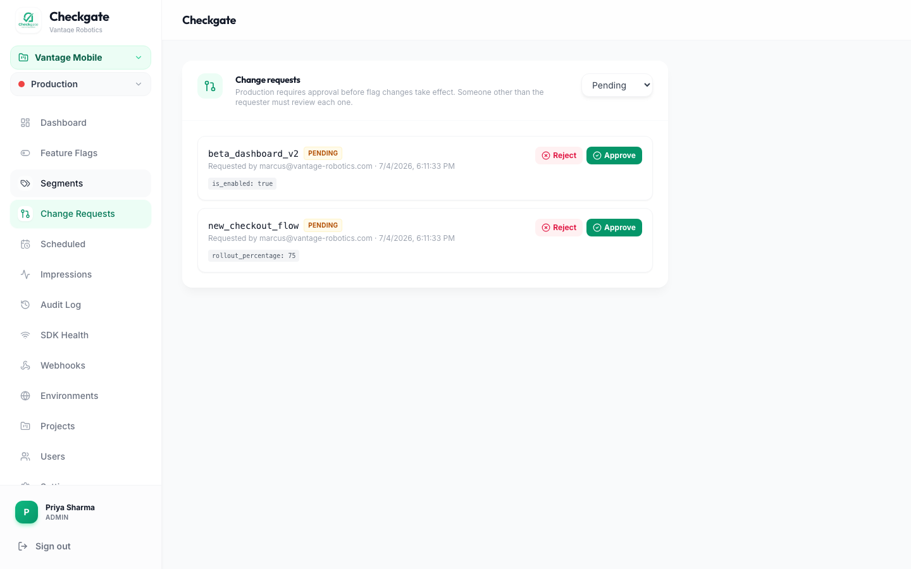
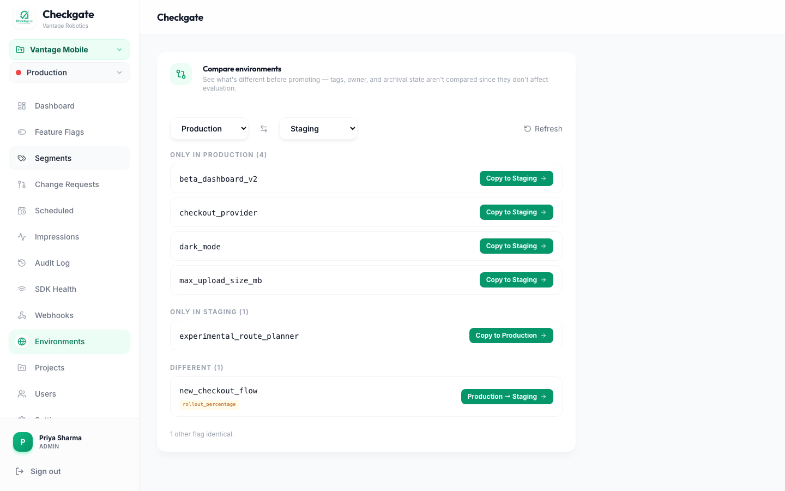
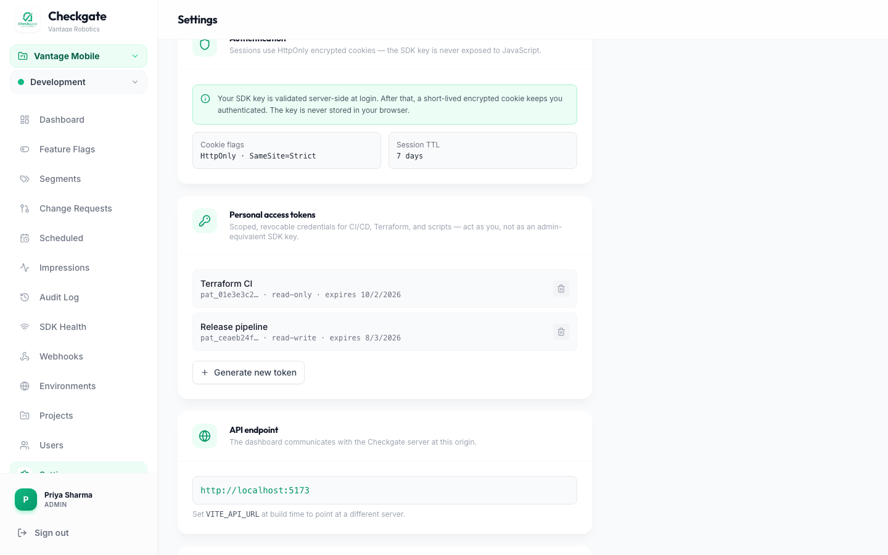
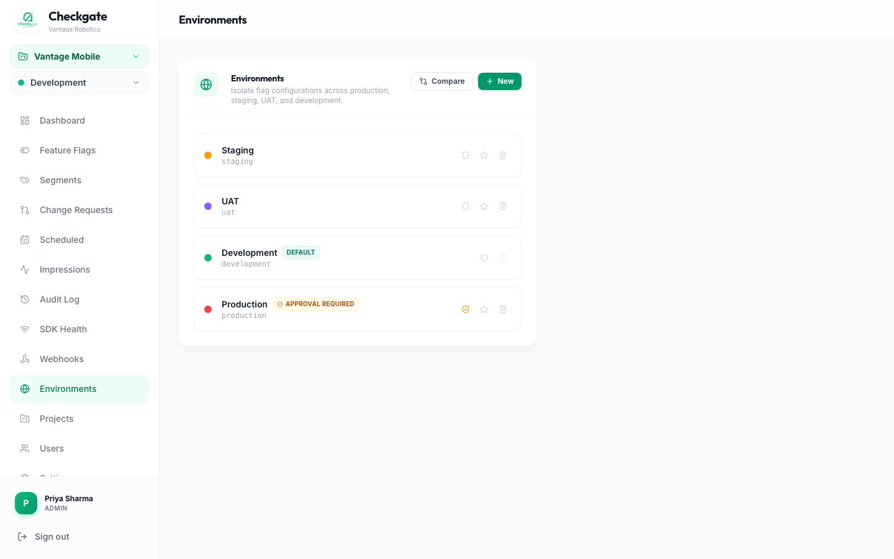

  

# Checkgate — Feature Flags Without the Round-Trip.

**Checkgate is an open-source feature flag engine that evaluates flags locally — no network call, no latency, no SaaS vendor.** Every flag decision happens inside your process in sub-microseconds, while a persistent SSE stream keeps every SDK instance in sync within 50 ms of a change.

It is proudly built in Rust and ships with native SDKs for Node.js (NAPI), browsers (WebAssembly), React Native (JSI), and Flutter (FFI). A persistent SSE stream propagates flag changes to every connected SDK instance in under 50 ms.

**[Explore the Documentation →](https://thinkgrid-labs.github.io/checkgate)**

---

## Features

- **Sub-microsecond evaluation** — flags are evaluated entirely in local memory
- **Real-time updates** — SSE push, not polling; changes land in < 50 ms
- **Targeting rules** — match by any user attribute (`email`, `plan`, `region`, …)
- **Percentage rollouts** — deterministic MurmurHash3 bucketing; sticky and independent per flag
- **Rust evaluation core** — compiled to NAPI, WASM, JSI, or FFI depending on platform
- **Self-hosted** — single binary + PostgreSQL + Redis; your data never leaves your infra

---

## Screenshots

*Dashboard shown with example data for a fictional company, Vantage Robotics.*

**Dashboard overview** — flag counts, rollout status, and recent activity at a glance.

**Feature flags** — tags, types, rollout percentage, and one-click enable/disable per environment.

**Flag editor** — targeting rules, tags, ownership, and prerequisite (dependent) flags.

**Change requests** — require a second reviewer before a flag change takes effect in sensitive environments; self-approval is blocked.

**Cross-environment diff** — see what's different between environments before promoting, with a one-click sync.

**Personal access tokens** — scoped, revocable API credentials for CI/CD and Terraform, as an alternative to admin-equivalent SDK keys.

**Environments** — isolate configuration across Production, Staging, UAT, and Development, with per-environment approval gates.

---

## Documentation

| Topic | Link |
|-------|------|
| Why Checkgate / comparisons | [What is Checkgate?](docs/guide/what-is-checkgate.md) |
| System architecture | [Architecture](docs/guide/architecture.md) |
| Flags, rules, rollout concepts | [Core Concepts](docs/guide/concepts.md) |
| Step-by-step setup | [Getting Started](docs/guide/getting-started.md) |
| REST API + SSE stream reference | [API Reference](docs/api-reference.md) |
| Node.js SDK | [SDK: Node.js](docs/sdks/nodejs.md) |
| Web (WASM) SDK | [SDK: Web](docs/sdks/web.md) |
| React Native (JSI) SDK | [SDK: React Native](docs/sdks/react-native.md) |
| Flutter (FFI) SDK | [SDK: Flutter](docs/sdks/flutter.md) |
| Docker, AWS, env vars | [Self-Hosting](docs/self-hosting.md) |
| Enterprise Setup & Migration | [Enterprise Setup & Migration](docs/enterprise-setup.md) |

---

## Contributing

See [CONTRIBUTING.md](CONTRIBUTING.md).

## License

MIT — see [LICENSE](LICENSE).
